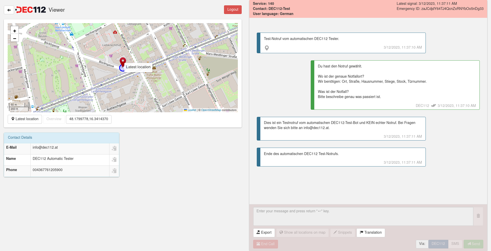

# DEC112 Viewer

A lightweight viewer for [DEC112](https://www.dec112.at) PSAP integration powered by **React**. It should simplify PSAP integration by providing a web frontend for sending and receiving text messages coming from the caller, as well as displaying the caller's location and additional personal data.



Find more information on NG112 and accessible emergency calls on our webpage: [https://www.dec112.at](https://www.dec112.at)

Many thanks to [Netidee](https://www.netidee.at) who funded this software project in call #12 (DEC112), #14 (DEC112 2.0) and #17 (DEC4IoT)!


## First run

### Prerequisites

*  [Node.js](https://nodejs.org/en/) installed
*  [yarn](https://yarnpkg.com/en/) package manager installed

### Installation

```sh
# install dependencies with
yarn install
# run DEC112 Viewer with
yarn start
```

Development server will be started on port 3000 and your default browser will be opened.

## Build

```sh
# production build INCLUDING source maps
yarn build
# production build WITHOUT source maps
yarn release
```

## Docker support

If you just want to build the docker image you need to provide a file `docker-build.js` in folder `scripts` that specifies how your docker image should be built and where it should be pushed to.

After that you can run:

`yarn docker`

For further configuration of the underlying nginx server, run the script `yarn docker` once. It will create a default configuration file `nginx.conf` in your project root, which you can use to configure your the nginx server running inside the docker container. This is especially important for adding your certificate and key in order to use SSL.

Alternatively, you can also mount an external `nginx.conf` as a docker volume and overwrite the internal one.

## Compatibility

### PSAP backend

DEC112 Viewer needs a compatible PSAP backend to fetch data from. Compatible backends are:

* DEC112 PSAP
* DEC112 Border (minimum version: 1.1.2)

### Semantic Container for Call Replays (Chat Bot)

Supported API version: v1

## UI-Languages

Currently, the following UI languages are supported:

* German (de)
* English (en)
* French (fr)
* Romanian (ro)
* Spanish (es)

## Terms

### Config

*Config* is the term for the final configuration object that is provided towards the viewer. It consists of a combination of *internal config*, *external config* and *server config*

The final *config* is established as follows 
*final config* is always established by merging the previous *final config* with the current *input config*  
Merge process goes from top to bottom:

| Config type | input config | final config |
| - | - | - |
| *internal config* | `{"appTitle": "DEC112"}` | `{"appTitle": "DEC112"}` |
| *external config* | `{"appTitle": "Viewer", list": [1, 2]}` | `{"appTitle": "Viewer", "list": [1, 2]}` |
| *server config* | `{"lang": "en"}` | `{"appTitle": "Viewer", "lang": "en", "list": [1, 2]}` |
| *client config* | `{"list": [3, 4]}` | `{"appTitle": "Viewer", "lang": "en", "list": [3, 4]}` |

Attention: This example is simplified.

#### Internal config

The internal config is provided through the files `config.dev.js` and `config.prod.js` (within folder `src/config`) and is compiled and can therefore not be changed, without recompiling the project. It serves as a default for externally configurable properties.

`config.dev.js` is used during development.  
`config.prod.js` is used for production builds.

All configuration parameters and their use are described in `config.dev.js`

Each parameter (if not specified otherwiese) can also be used in *external config*

#### External config

The *external config* is loaded on application start and is provided via json files `dec112.config.dev.json` and `dec112.config.json`.

`dec112.config.dev.json` is loaded during development.
`dec112.config.json` is loaded in production builds.

During development, you can find both files in folder `public`. In production builds, the file `dec112.config.json` is placed in the build's root.

Each parameter that is specified in *external config*, will overwrite the respective parameter in *internal config*. This means, *external config* is applied on top of *internal config*.

#### Server config

The *server config* is loaded by calling the method *get_config* against the currently used *mapper*. In case of `BorderMapper`, a call with `"method": "get_config"` is placed via websocket (only valid vor API version 2). The server may then respond with an appropriate config. If `SemanticContainerMapper` is used, the call to `get_config` is dropped, as semantic containers do not support this kind of configuration.

*Server config* is completely optional and therefore may not exist (e.g. the call might be dropped)

Each parameter that is specified in *server config*, will overwrite the respective parameter in *external config*. This means, *server config* is applied on top of *internal config* AND *external config*.

#### Client config

*Config* supports 0-n *clients*. *Clients* can be configured within the property `client` in *internal config*, *external config* and *server config*. The *client*'s id is used as the identifier for each *client*. You can find an example of such a configuration in the file `src/config/config.dev.js`.

A *client*'s *config* is applied on top of *internal config*, *external config* and *server config* and will therefore overwrite preexisting properties.

A *client*'s *config* is applied, whenever a user logs into DEC112 viewer, or a previous session/login is restored automatically.

### Client

A *client* is a user or an organization that is using the DEC112 viewer. It can have a different *config* from default one.

## Custom types

### LanguageObject

LanguageObject type is used to provide internationalization (i18n) within *config*. LanguageObject exmple:

```json
{
  "de": "Hallo Welt",
  "en": "Hello world",
  "es": "Hola mundo"
}
```

Two character ISO language codes are used as object properties. The respective values represent the translation.

## Debug information

When in debug mode (configurable via *config*), debug information is logged inside the browser's console.

Debug mode can always be forced by issuing `DEC112Debug.enable()` in the browser's console. This will log all subsequent logs automatically.

To get a list with all already logged logs, issue `DEC112Debug.print()` in the browser's console.

## UI specialities

### Login

The login form provides three fields. Server, Username and Password.

#### Server

The placeholder within this field describes the endpoint, DEC112 viewer connects to by default, if no other value is provided.

The input only accepts valid URLs. 

If a URL with protocol `ws` or `wss` is provided, Username and Password fields will be available, as DEC112 viewer assumes the server behind this URL is a border gateway, used for normal call taking.

If a URL with protocol `http` or `https` is provided, Username and Password fields will be disabled, as DEC112 viewer assumes the server behind this URL is a semantic container, used for call replays. In this case, no username or password is needed.

#### Username

The input in this field is, of course, used for authentication, but also as *client* for *config*.

#### Password

This value may or may not be needed. This depends on border gateway configuration

### Call overview

Without any special configuration, the call overview is shown after logging in. Currently active calls are highlighted with a pulsing, red color. 

Call replays are highlighted in a yellow, non pulsing, color. This kind of calls don't have a regular "State", but are rather marked as "Call Replay".

### Main view

The main view contains main information about a call and is divided in up to four sections. Each of these sections can be enabled/disabled in *config*.

#### Map panel

Displays (by default) all available call locations. 

The latest location is highlighted by a map marker. In addition, it also features a proximity circle, stating the approximate accuracy of this location (in meters).

The very first location is also highlighted by a map marker, which opacity was decreased, to be distinguishable to the other marker.

All intermediate locations are connected by a colored polyline.

If a specific location is selected (e.g. on message panel). This location will be highlighted (including showing the map marker and proximity circle), instead of the latest one. The polyline will still show all available locations

Button "Center map" will center the map, but will not change the map's zoom level.

Button "Overview" will adjust the map in a way that all available locations are visible. This includes panning and zooming.

#### Trigger panel

The trigger panel will show buttons that execute triggers manually (if configured in *config*). By clicking a button, the respective trigger execution will be requested at server. It is important to note that **clicking a button is only a trigger request**, not an already confirmed execution!

#### Message panel

This view's appearance depends on the type of call selected.

##### General

By clicking on a map marker symbol that is attached to an incoming message, you can highlight the location that is attached to this message, on the map.

By clicking "Show all locations on map", you can release this selection. The same is true for clicking on the map marker, on the incoming message, again.

##### Normal call

The text area allow you to compose your message that should be sent to the caller. The "trash" button right to the text area allows you to clear the entered message.

Call snippets can be handy for writing messages. They can be accessed by clicking the button "Snippets". If specified, snippets also provide keyboard shortcuts (written in square brackets on the snippet) for faster interaction. These shortcuts can also be used, if the snippets panel is not visible.

"End call" ends a call. You will have to confirm this action.

##### Call replay

For this type of call you will see the replay panel, that allows you to navigate back and forth within the call, by clicking/dragging the progress bar. If you want to step to the next/previous text message, you can do so by clicking "Forward" or "Backward".

The dropdown next to "Play"/"Pause" lets you select the playback speed of the call replay, when in play mode. Default is "1x", which means, that each second within the original call is equals to one second in the call replay.

#### Data panel

Additional data within the call (e.g. caller's name, telephone number...) is displayed within this panel. If a property starts with an underscore (_), the property is not shown on this panel as it is considered as private.

If data is available, the respective value can be copied to the user's clipboard by clicking the "copy to clipboard" button next to the value.
___

This project was bootstrapped with [Create React App](https://github.com/facebook/create-react-app).

## Available Scripts

In the project directory, you can run:

### `yarn start`

Runs the app in the development mode.  
Open [http://localhost:3000](http://localhost:3000) to view it in the browser.

The page will reload if you make edits.  
You will also see any lint errors in the console.

### `yarn release`

Builds the app for production to the `build` folder.  
It correctly bundles React in production mode and optimizes the build for the best performance.

The build is minified and the filenames include the hashes.  

See the section about [deployment](https://facebook.github.io/create-react-app/docs/deployment) for more information.

### `yarn build`

Same as `yarn build`, but including source maps.

### `yarn eject`

**Note: this is a one-way operation. Once you `eject`, you can’t go back!**

If you aren’t satisfied with the build tool and configuration choices, you can `eject` at any time. This command will remove the single build dependency from your project.

Instead, it will copy all the configuration files and the transitive dependencies (Webpack, Babel, ESLint, etc) right into your project so you have full control over them. All of the commands except `eject` will still work, but they will point to the copied scripts so you can tweak them. At this point you’re on your own.

You don’t have to ever use `eject`. The curated feature set is suitable for small and middle deployments, and you shouldn’t feel obligated to use this feature. However we understand that this tool wouldn’t be useful if you couldn’t customize it when you are ready for it.

## Learn More

You can learn more in the [Create React App documentation](https://facebook.github.io/create-react-app/docs/getting-started).

To learn React, check out the [React documentation](https://reactjs.org/).
